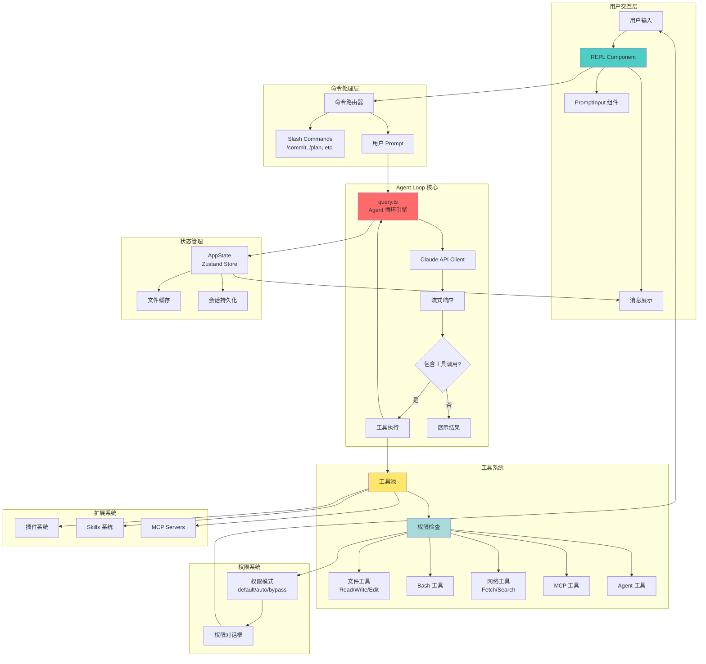
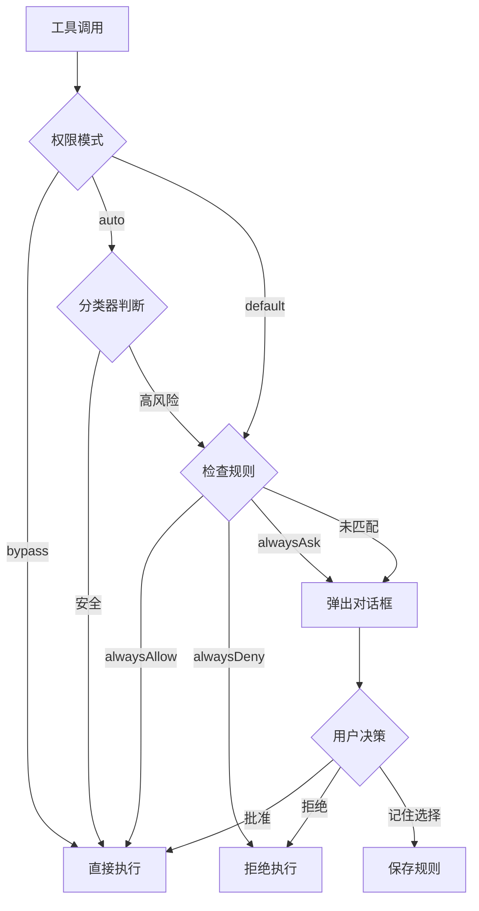

# Claude Code v2.1.88 架构分析

## 项目概述

Claude Code 是 Anthropic 开发的一款 AI 编程助手工具，它将 Claude AI 模型的能力与终端环境深度集成，为开发者提供交互式的代码编写、调试、重构等辅助功能。该项目采用 TypeScript 开发，使用 React（Ink框架）构建终端 UI，通过工具系统（Tool System）实现 AI 与系统环境的交互。

**关键特性：**
- 基于 REPL（Read-Eval-Print Loop）的交互式会话
- 强大的工具调用系统（30+ 内置工具）
- 权限控制和沙箱隔离机制
- 插件和技能（Skills）扩展系统
- 多模态支持（文本、图片、文件）
- MCP（Model Context Protocol）集成
- Agent 协作和任务管理

---

## 目录结构说明

```
src/
├── main.tsx                    # 主入口文件，启动流程和初始化
├── query.ts                    # Agent Loop 核心逻辑，消息迭代处理
├── Tool.ts                     # 工具系统类型定义和接口
├── tools.ts                    # 工具注册和管理
├── commands.ts                 # 命令系统（slash commands）
│
├── screens/                    # UI 界面层
│   ├── REPL.tsx               # 核心 REPL 组件（895KB，核心交互逻辑）
│   └── ResumeConversation.tsx  # 会话恢复
│
├── tools/                      # 30+ 工具实现
│   ├── BashTool/              # Shell 命令执行
│   ├── FileEditTool/          # 文件编辑（精确字符串替换）
│   ├── FileReadTool/          # 文件读取
│   ├── FileWriteTool/         # 文件写入
│   ├── GrepTool/              # 内容搜索（基于 ripgrep）
│   ├── GlobTool/              # 文件模式匹配
│   ├── AgentTool/             # 子 Agent 调用
│   ├── AskUserQuestionTool/   # 用户交互问答
│   ├── WebFetchTool/          # 网页抓取
│   ├── WebSearchTool/         # 网页搜索
│   ├── MCPTool/               # MCP 协议工具调用
│   └── ...
│
├── services/                   # 核心服务层
│   ├── api/                   # API 客户端（Anthropic SDK）
│   ├── mcp/                   # MCP 服务管理
│   ├── compact/               # 上下文压缩服务
│   ├── tools/                 # 工具编排和执行
│   ├── analytics/             # 遥测和分析
│   ├── lsp/                   # Language Server Protocol
│   └── plugins/               # 插件系统
│
├── state/                      # 全局状态管理
│   ├── AppState.tsx           # 应用状态定义
│   ├── AppStateStore.ts       # 状态存储（基于 Zustand）
│   └── store.ts               # 状态管理核心
│
├── utils/                      # 工具函数库
│   ├── permissions/           # 权限系统
│   ├── messages/              # 消息处理
│   ├── sessionStorage.js      # 会话持久化
│   ├── git/                   # Git 集成
│   ├── sandbox/               # 沙箱隔离
│   └── ...
│
├── components/                 # React 组件（Ink UI）
│   ├── messages/              # 消息展示组件
│   ├── permissions/           # 权限对话框
│   ├── PromptInput/           # 输入框组件
│   └── ...
│
├── tasks/                      # 后台任务系统
│   ├── LocalAgentTask/        # 本地 Agent 任务
│   ├── RemoteAgentTask/       # 远程 Agent 任务
│   └── InProcessTeammateTask/ # 团队协作任务
│
├── skills/                     # Skills 扩展系统
│   └── bundled/               # 内置技能
│
├── plugins/                    # 插件系统
│   └── bundled/               # 内置插件
│
├── commands/                   # 80+ Slash 命令实现
│   ├── commit/                # Git 提交
│   ├── review/                # 代码审查
│   ├── plan/                  # 计划模式
│   └── ...
│
├── bootstrap/                  # 启动时配置和状态
├── context/                    # React Context 提供者
├── hooks/                      # React Hooks
├── ink/                        # 终端 UI 框架扩展
├── types/                      # TypeScript 类型定义
└── constants/                  # 常量定义
```

---

## 核心架构图



---

## 关键模块分析

### 1. 入口模块：main.tsx

**职责：**
- 应用启动和初始化
- CLI 参数解析
- 配置加载（settings.json、CLAUDE.md）
- 认证和授权
- 工具、插件、技能加载
- REPL 启动

**关键初始化流程：**
```typescript
// 启动性能优化（并行预取）
startMdmRawRead()           // MDM 配置读取
startKeychainPrefetch()     // 钥匙串预取

// 初始化流程
init()                      // 基础初始化
  ├── 加载全局配置
  ├── 认证验证
  ├── 加载 MCP 服务
  ├── 加载插件
  ├── 加载技能
  └── 初始化工具池

launchRepl()               // 启动 REPL
```

**设计亮点：**
- **并行预取优化**：在模块加载的同时启动耗时的系统调用（MDM、Keychain），减少启动时间
- **条件编译**：使用 `feature()` 实现死代码消除，外部构建自动排除内部功能
- **配置分层**：全局配置 → 项目配置 → MDM 配置，优先级明确

---

### 2. Agent Loop 核心：query.ts

**职责：**
- 实现 Agent 循环（Agent Loop）
- 管理与 Claude API 的交互
- 处理流式响应
- 工具调用编排
- 上下文管理和压缩

**核心流程：**
```typescript
async function* query(params: QueryParams) {
  while (true) {
    // 1. 构建请求上下文
    const context = buildSystemPrompt() + userContext
    
    // 2. 调用 Claude API（流式）
    const stream = await claude.messages.stream({
      model: currentModel,
      messages: normalizedMessages,
      tools: availableTools,
      system: systemPrompt
    })
    
    // 3. 处理流式响应
    for await (const event of stream) {
      if (event.type === 'content_block_delta') {
        yield { type: 'text', content: event.delta.text }
      }
      if (event.type === 'tool_use') {
        // 4. 执行工具调用
        const result = await executeToolUse(event)
        messages.push(result)
      }
    }
    
    // 5. 检查是否需要继续
    if (!hasToolUse(response)) break
  }
}
```

**关键机制：**
- **流式处理**：使用 async generator 实现实时响应流
- **工具调用循环**：自动处理 `tool_use` → `tool_result` → 下一轮 API 调用
- **Token 预算管理**：支持 `task_budget` 限制单次任务的总输出量
- **错误恢复**：处理 `max_output_tokens` 错误，自动继续对话
- **上下文压缩**：检测 prompt_too_long 并触发自动压缩

---

### 3. REPL 组件：screens/REPL.tsx

**职责：**
- 核心 UI 交互逻辑
- 消息队列管理
- 用户输入处理
- 权限对话框管理
- 会话状态维护
- 键盘快捷键处理

**架构特点：**
- **895KB 超大组件**：包含大量业务逻辑和状态管理
- **事件驱动**：基于 React Hooks 和事件回调
- **多模态输入**：支持文本、Vim 模式、语音输入
- **消息队列**：实现 slash 命令的队列化处理

**核心 Hooks：**
```typescript
// 消息和状态管理
const [messages, setMessages] = useAppState(s => s.messages)
const [toolPermissionContext, setToolPermissionContext] = useState()

// 工具和命令管理
const tools = useMergedTools()
const commands = useMergedCommands()

// 输入处理
const handlePromptSubmit = useCallback(async (input: string) => {
  if (isSlashCommand(input)) {
    await executeCommand(input)
  } else {
    await query({ messages, systemPrompt, ... })
  }
}, [messages])

// 权限处理
const canUseTool = useCanUseTool({
  permissionContext: toolPermissionContext,
  onPermissionRequest: (request) => showPermissionDialog(request)
})
```

---

### 4. 工具系统：tools/ 和 Tool.ts

**架构设计：**

每个工具遵循统一接口：
```typescript
interface Tool {
  name: string
  description: string
  input_schema: ToolInputJSONSchema  // Zod schema
  
  // 执行方法（支持流式输出）
  execute(
    args: ToolInput,
    context: ToolUseContext
  ): AsyncGenerator<ToolProgressData, ToolResult>
  
  // 权限检查
  requiresPermission?(args: ToolInput): boolean
}
```

**工具分类：**

1. **文件操作工具**
   - `Read`：读取文件（支持分页、PDF、图片、Jupyter Notebook）
   - `Write`：写入文件（需先读取以防覆盖）
   - `Edit`：精确字符串替换（基于 `old_string` → `new_string`）
   - `Glob`：文件模式匹配（基于通配符）
   - `Grep`：内容搜索（基于 ripgrep，支持正则）

2. **执行工具**
   - `Bash`：执行 Shell 命令（支持后台运行、超时控制）
   - `PowerShell`：Windows PowerShell 执行

3. **交互工具**
   - `AskUserQuestion`：向用户提问（支持多选、预览）
   - `TodoWrite`：任务列表管理

4. **网络工具**
   - `WebFetch`：抓取网页内容（HTML → Markdown）
   - `WebSearch`：网页搜索（集成搜索引擎）

5. **高级工具**
   - `Agent`：调用子 Agent（支持后台运行、隔离环境）
   - `MCP`：调用 MCP 协议工具
   - `Skill`：执行用户自定义技能

**工具编排：StreamingToolExecutor**

位于 `services/tools/StreamingToolExecutor.ts`，负责：
- 并行执行多个工具调用
- 实时流式输出工具进度
- 错误处理和重试
- 工具结果缓存

---

### 5. 权限模型：utils/permissions/

**权限模式（Permission Mode）：**

```typescript
type PermissionMode = 
  | 'default'    // 默认模式：每次工具调用都询问
  | 'auto'       // 自动模式：自动批准安全工具，高风险仍需询问
  | 'bypass'     // 旁路模式：自动批准所有工具（需用户主动启用）
```

**权限决策流程：**


**权限规则（Permission Rules）：**
- 基于 **工具名称 + 参数模式** 进行匹配
- 支持通配符和正则表达式
- 存储在 settings.json 中

示例：
```json
{
  "permissions": {
    "alwaysAllow": {
      "user": [
        { "tool": "Read", "pattern": "/home/user/project/**" },
        { "tool": "Bash", "pattern": "npm test" }
      ]
    },
    "alwaysDeny": {
      "user": [
        { "tool": "Bash", "pattern": "rm -rf /" }
      ]
    }
  }
}
```

**安全机制：**
- **沙箱隔离**：支持 Docker/Firecracker 沙箱执行工具
- **文件系统限制**：工作目录外的文件访问需额外权限
- **危险命令检测**：自动识别 `rm -rf`、`sudo` 等高风险命令
- **Hook 系统**：用户可配置 pre/post hooks 验证工具执行

---

### 6. 消息处理：utils/messages.ts

**消息类型：**
```typescript
type Message =
  | UserMessage          // 用户输入
  | AssistantMessage     // AI 响应
  | ToolUseMessage       // 工具调用请求
  | ToolResultMessage    // 工具执行结果
  | SystemMessage        // 系统消息
  | ProgressMessage      // 进度提示
  | CompactBoundaryMessage  // 压缩边界标记
```

**消息流转：**
```
用户输入 → UserMessage
    ↓
Query → Claude API
    ↓
AssistantMessage + ToolUseBlock[]
    ↓
工具执行 → ToolResultMessage
    ↓
Query → Claude API（带工具结果）
    ↓
AssistantMessage（最终响应）
```

**消息归一化（normalizeMessagesForAPI）：**
- 移除 UI 专用字段（uuid、timestamp）
- 合并连续的 user/assistant 消息
- 处理图片和附件
- 移除 thinking blocks（根据配置）

---

### 7. 上下文管理：services/compact/

**问题：** Claude API 有上下文长度限制（如 200K tokens），长对话会超限。

**解决方案：**

1. **Microcompact（微压缩）**
   - 删除工具调用的冗余输出（如大文件内容）
   - 保留工具调用摘要

2. **Partial Compact（部分压缩）**
   - 压缩历史对话的中间部分
   - 保留最近的消息

3. **Full Compact（完全压缩）**
   - 使用 Claude 模型总结整个对话历史
   - 生成简洁摘要替换原始消息

4. **Reactive Compact（响应式压缩）**
   - 检测到 `prompt_too_long` 错误时自动触发
   - 无需用户干预

**压缩边界（Compact Boundary）：**
- 在消息流中插入 CompactBoundaryMessage
- 后续操作只保留边界后的消息
- 边界前的内容被摘要替代

---

## 数据流分析

### 1. 典型对话流程

```
┌──────────────────────────────────────────────────────────────┐
│ 用户输入: "帮我重构 src/utils.ts 文件"                        │
└────────────┬─────────────────────────────────────────────────┘
             │
             ▼
┌──────────────────────────────────────────────────────────────┐
│ REPL.tsx: handlePromptSubmit()                               │
│  - 检查是否为 slash command                                   │
│  - 创建 UserMessage                                          │
│  - 添加到 messages 数组                                       │
└────────────┬─────────────────────────────────────────────────┘
             │
             ▼
┌──────────────────────────────────────────────────────────────┐
│ query.ts: query()                                            │
│  - 构建系统提示词（system prompt）                            │
│  - 注入用户上下文（git status、file list）                    │
│  - 构建工具列表                                               │
└────────────┬─────────────────────────────────────────────────┘
             │
             ▼
┌──────────────────────────────────────────────────────────────┐
│ Claude API: messages.stream()                                │
│  model: "claude-sonnet-4-6"                                  │
│  messages: [...]                                             │
│  tools: [Read, Write, Edit, Bash, ...]                      │
└────────────┬─────────────────────────────────────────────────┘
             │
             ▼
┌──────────────────────────────────────────────────────────────┐
│ 流式响应:                                                     │
│  1. thinking block: "需要先读取文件..."                       │
│  2. tool_use: Read(file_path="src/utils.ts")                │
└────────────┬─────────────────────────────────────────────────┘
             │
             ▼
┌──────────────────────────────────────────────────────────────┐
│ StreamingToolExecutor: executeToolUse()                      │
│  - 检查权限（canUseTool）                                     │
│  - 执行 FileReadTool.execute()                               │
│  - 返回文件内容                                               │
└────────────┬─────────────────────────────────────────────────┘
             │
             ▼
┌──────────────────────────────────────────────────────────────┐
│ query.ts: 构建 ToolResultMessage                             │
│  - tool_use_id: "toolu_xxx"                                  │
│  - content: "文件内容..."                                     │
└────────────┬─────────────────────────────────────────────────┘
             │
             ▼
┌──────────────────────────────────────────────────────────────┐
│ query.ts: 继续循环，再次调用 API                              │
│  messages: [..., ToolResultMessage]                          │
└────────────┬─────────────────────────────────────────────────┘
             │
             ▼
┌──────────────────────────────────────────────────────────────┐
│ Claude API 响应:                                             │
│  1. thinking: "分析代码结构..."                               │
│  2. tool_use: Edit(old_string="...", new_string="...")      │
└────────────┬─────────────────────────────────────────────────┘
             │
             ▼
┌──────────────────────────────────────────────────────────────┐
│ FileEditTool: 执行字符串替换                                  │
│  - 验证 old_string 唯一性                                     │
│  - 执行替换                                                   │
│  - 返回成功消息                                               │
└────────────┬─────────────────────────────────────────────────┘
             │
             ▼
┌──────────────────────────────────────────────────────────────┐
│ query.ts: 再次调用 API                                       │
└────────────┬─────────────────────────────────────────────────┘
             │
             ▼
┌──────────────────────────────────────────────────────────────┐
│ Claude API 响应（文本，无工具调用）:                          │
│  "我已完成重构，主要改动包括..."                              │
└────────────┬─────────────────────────────────────────────────┘
             │
             ▼
┌──────────────────────────────────────────────────────────────┐
│ REPL.tsx: 展示最终响应                                       │
│  - 添加 AssistantMessage 到 messages                         │
│  - 保存会话到磁盘                                             │
└──────────────────────────────────────────────────────────────┘
```

### 2. 权限检查流程

```
工具调用
    │
    ▼
┌─────────────────────────┐
│ canUseTool(tool, args) │
└───────────┬─────────────┘
            │
            ▼
     ┌──────────────┐
     │ 权限模式检查 │
     └──────┬───────┘
            │
    ┌───────┴────────┐
    │                │
    ▼                ▼
 bypass         auto/default
    │                │
    │                ▼
    │         ┌──────────────┐
    │         │ 检查规则库   │
    │         └──────┬───────┘
    │                │
    │        ┌───────┼───────┐
    │        │       │       │
    │        ▼       ▼       ▼
    │    alwaysAllow  │   alwaysDeny
    │        │        │       │
    │        │        ▼       │
    │        │   ┌─────────┐ │
    │        │   │ auto模式│ │
    │        │   │ 分类器  │ │
    │        │   └────┬────┘ │
    │        │        │       │
    │        │   ┌────┴────┐ │
    │        │   │         │ │
    │        │   ▼         ▼ │
    │        │  安全    高风险│
    │        │   │         │ │
    ├────────┼───┘         │ │
    │        │             ▼ │
    │        │      ┌──────────┐
    │        │      │ 权限对话框│
    │        │      └─────┬────┘
    │        │            │
    │        │      ┌─────┴─────┐
    │        │      │           │
    │        │      ▼           ▼
    │        │    批准        拒绝
    │        │      │           │
    │        │      │    ┌──────┘
    │        │      │    │
    ├────────┼──────┘    │
    │        │           │
    ▼        ▼           ▼
  执行工具           拒绝执行
```

---

## 设计亮点和值得学习的点

### 1. 流式架构设计

**问题：** 传统同步 API 调用会阻塞 UI，用户体验差。

**解决方案：**
- 使用 **async generator** 实现流式处理
- UI 实时展示 AI 思考过程和工具执行进度
- 工具执行可并行化（如同时读取多个文件）

```typescript
// 流式工具执行
async function* executeToolUse(toolUse) {
  yield { type: 'progress', message: '正在执行...' }
  const result = await tool.execute(args)
  yield { type: 'result', content: result }
}
```

**优势：**
- 响应速度快，用户可提前看到部分结果
- 支持长时间运行的工具（如编译、测试）
- 可随时中断（Ctrl+C）

---

### 2. 工具系统的可扩展性

**设计原则：**
- **接口统一**：所有工具实现相同接口（Tool interface）
- **插件化**：支持用户自定义工具（通过插件系统）
- **MCP 集成**：支持第三方 MCP 服务提供的工具

**扩展方式：**

1. **内置工具**：直接在 `src/tools/` 添加
2. **插件工具**：通过 `~/.claude/plugins/` 加载
3. **MCP 工具**：通过 MCP 服务器动态加载
4. **技能（Skills）**：通过 prompt 模板定义

**工具池合并（Tool Pool Merge）：**
```typescript
const toolPool = mergeAndFilterTools([
  ...builtInTools,       // 内置工具
  ...pluginTools,        // 插件工具
  ...mcpTools,           // MCP 工具
  ...agentTools          // Agent 专用工具
])
```

---

### 3. 权限系统的分层设计

**分层结构：**
```
┌─────────────────────────────────────┐
│  Policy Layer (策略层)              │
│  - MDM/企业策略强制禁用某些工具     │
└──────────────┬──────────────────────┘
               │
┌──────────────▼──────────────────────┐
│  Permission Mode (模式层)           │
│  - default / auto / bypass          │
└──────────────┬──────────────────────┘
               │
┌──────────────▼──────────────────────┐
│  Rules Layer (规则层)               │
│  - alwaysAllow / alwaysDeny / Ask   │
└──────────────┬──────────────────────┘
               │
┌──────────────▼──────────────────────┐
│  Classifier Layer (分类器层)        │
│  - AI 自动判断风险（仅 auto 模式）   │
└──────────────┬──────────────────────┘
               │
┌──────────────▼──────────────────────┐
│  User Interaction (用户交互层)      │
│  - 权限对话框、批准/拒绝             │
└─────────────────────────────────────┘
```

**优势：**
- **企业级控制**：MDM 策略可强制覆盖用户设置
- **灵活性**：用户可自定义规则
- **智能化**：auto 模式利用 AI 判断安全性
- **审计追踪**：所有权限决策都有日志

---

### 4. 上下文压缩策略

**多级压缩机制：**

| 压缩类型 | 触发时机 | 压缩内容 | 保留内容 |
|---------|---------|---------|---------|
| **Microcompact** | 每次工具调用后 | 工具结果的冗余部分 | 工具调用摘要 |
| **Partial Compact** | 接近上下文限制 | 历史对话的中间部分 | 最近 N 条消息 |
| **Full Compact** | 用户手动触发 | 整个对话历史 | 压缩摘要 |
| **Reactive Compact** | 收到 prompt_too_long | 自动选择压缩策略 | 根据策略决定 |

**智能压缩算法：**
```typescript
// 检测哪些工具结果可以微压缩
if (toolResult.size > THRESHOLD && !isReferenced(toolResult)) {
  // 替换为摘要
  toolResult.content = summarize(toolResult.content)
}
```

---

### 5. Agent 协作架构

**Agent 类型：**

1. **LocalAgentTask**
   - 在当前进程中运行
   - 共享文件系统和工具
   - 适合短期任务

2. **RemoteAgentTask**
   - 通过 API 调用远程 Agent
   - 隔离执行环境
   - 适合长期后台任务

3. **InProcessTeammateTask**
   - 团队协作模式
   - 多个 Agent 共享上下文
   - 适合复杂多步骤任务

**Agent 通信：**
- 通过 **Mailbox** 机制传递消息
- 支持 Agent 间的工具调用代理
- 权限可继承或独立管理

---

### 6. 会话持久化和恢复

**持久化机制：**
- 所有消息保存到 `~/.claude/sessions/<session_id>.jsonl`
- 使用 JSONL 格式（每行一个 JSON 对象）
- 支持增量写入（append-only）

**恢复机制：**
```typescript
// 恢复会话
const { messages, metadata } = loadTranscriptFromFile(sessionId)

// 恢复状态
const fileCache = reconstructContentReplacementState(messages)
const fileHistory = reconstructFileHistory(messages)
const worktreeState = reconstructWorktreeState(messages)

// 继续对话
await query({ messages, ... })
```

**优势：**
- 支持跨设备同步（通过 session ID）
- 可审计（完整对话历史）
- 支持时间旅行（rewind 到历史状态）

---

### 7. 终端 UI 的性能优化

**挑战：** Ink 是基于 React 的终端 UI 框架，大量消息渲染会导致性能问题。

**优化策略：**

1. **虚拟滚动**
   - 只渲染可见区域的消息
   - 使用 `VirtualMessageList` 组件

2. **消息分页**
   - 历史消息按需加载
   - 减少初始渲染时间

3. **防抖和节流**
   - 输入框使用 `useDeferredValue`
   - 滚动事件节流处理

4. **React Compiler**
   - 使用 React 19 的实验性编译器
   - 自动优化组件渲染

```typescript
// 虚拟滚动实现
const visibleMessages = useMemo(() => {
  const start = scrollTop / MESSAGE_HEIGHT
  const end = start + viewportHeight / MESSAGE_HEIGHT
  return messages.slice(start, end)
}, [messages, scrollTop, viewportHeight])
```

---

### 8. 插件和技能系统

**插件系统架构：**
```
~/.claude/plugins/
├── my-plugin/
│   ├── manifest.json       # 插件元数据
│   ├── tools/              # 自定义工具
│   │   └── MyTool.ts
│   └── skills/             # 自定义技能
│       └── my-skill.md
```

**manifest.json 示例：**
```json
{
  "name": "my-plugin",
  "version": "1.0.0",
  "tools": ["tools/MyTool.ts"],
  "skills": ["skills/my-skill.md"],
  "permissions": {
    "filesystem": ["read", "write"],
    "network": ["fetch"]
  }
}
```

**技能（Skills）系统：**
- 基于 **Markdown 模板**
- 使用 frontmatter 定义元数据
- 支持参数化和条件逻辑

示例：
```markdown
---
name: commit
description: Create a git commit
whenToUse: When the user asks to commit changes
---

# Commit Changes

1. Run `git status` to check changes
2. Run `git add -A` to stage all files
3. Generate commit message based on changes
4. Run `git commit -m "<message>"`
```

---

## 总结

Claude Code 是一个**架构精良、设计优雅**的 AI 编程助手项目，其核心亮点包括：

1. **流式架构**：充分利用 async generator 实现实时响应
2. **工具系统**：高度可扩展，支持插件和 MCP 集成
3. **权限模型**：分层设计，兼顾安全性和灵活性
4. **上下文管理**：多级压缩策略，高效利用有限上下文
5. **Agent 协作**：支持多 Agent 并行和协作
6. **性能优化**：虚拟滚动、增量渲染、React Compiler
7. **可扩展性**：插件、技能、MCP 三位一体

**值得学习的技术点：**
- TypeScript 大型项目架构
- React 复杂状态管理（Zustand）
- Ink 终端 UI 开发
- 流式 API 设计
- 权限系统设计
- 插件化架构
- AI Agent 编排

这个项目为构建 AI 赋能的开发工具提供了一个优秀的参考范例。
